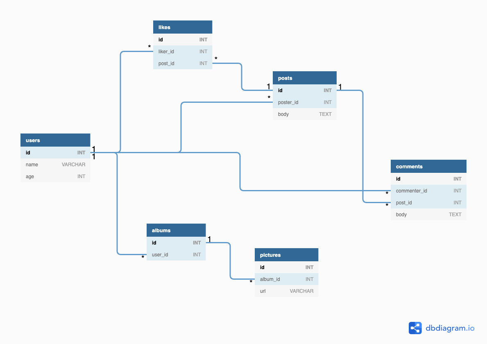

# Pursuit-Core-Web-Postgres-Lab

Build a database for a Facebook-style app. Your Database should have **SQL tables** for the following data: Users, Posts, and Pictures.

Let's expand this simple structure to something a little bit deeper. Let's also use the conceptual structure of _primary_ and _foreign_ keys. Our database, at the end of the day, should be structured like this:

- Users (_table_)
  - `id` (_column_): integer, **primary key**
  - `name`: string
  - `age`: integer
- Posts
  - `id`: integer, **primary key**
  - `poster_id`: integer, **foreign key** referencing the column `id` in Users.
  - `body`: string
- Likes
  - `id`: integer, **primary key**
  - `liker_id`: integer, **foreign key** referencing the column `id` in Users
  - `post_id`: integer, **foreign key** referencing the column `id` in Posts.
- Comments
  - `id`: integer, **primary key**
  - `commenter_id`: integer, **foreign key** referencing the column `id` in Users.
  - `post_id`: integer, **foreign key** referencing the column `id` in Posts.
  - `body`: string
- Albums
  - `id`: integer, **primary key**
  - `user_id`: integer, **foreign key** referencing the column `id` in Users
- Pictures
  - `id`: integer, **primary key**
  - `album_id`: integer, **foreign key** referencing the column `id` in Albums
  - `url`: string

## Diagram


[Interactive Diagram Here](https://dbdiagram.io/d/5db872c3fa792a62f50da1a5)

## Explanation
Let's think about these associations. In a vacuum, it might not be clear what each individual one is doing. However, we can gain a better understanding when we think about what, exactly, each of these associations is for.

Let's break it down:

- Users can create many Posts and Albums. They can also create Likes and Comments on Posts. Therefore, all of these tables have a direct relationship to Users via some kind of `user_id` column.
- Posts can have many Comments and Likes.
- Comments and Likes are connected to both the Users table and the Posts table. This is because, even though Posts are made by one user, a comment could be made by a different user.
- Albums contain many Pictures, but each Picture isn't associated with a User - they are associated with an Album, which is then associated with a User. This is because only the user who created the Album can add a Picture to it. Therefore, a `user_id` column in Pictures would be redundant.

Your task today is to create a .sql file that creates and properly associates these tables.

## Bonus

Here is an example syntax for adding a couple of users:

```
INSERT INTO users (name, age) VALUES ("Victoria Adams", 47), ("Gerson Lopez", 33);
```

A couple of things are critical about this:

- Because the `id` column is a `SERIAL PRIMARY KEY`, it will automatically create new `id`s when you add new users. So, we aren't including `id`s in our columns here.
- In our `VALUES` section, each value must have exactly the same number of columns as the model outlined in `INSERT INTO`. For example, this one has two columns (`(name, age)`), and therefore each User added has two columns as well.

Underneath your table structure, go ahead and add some `INSERT` statements to seed your database with some information.

**Hint**: Be sure to create tables/items with primary keys before you create tables/items with their corresponding foreign keys! For example, I'm not going to create Posts before I create Users- my database won't be able to recogize the User my new Post is connected to, because I haven't created one yet!
